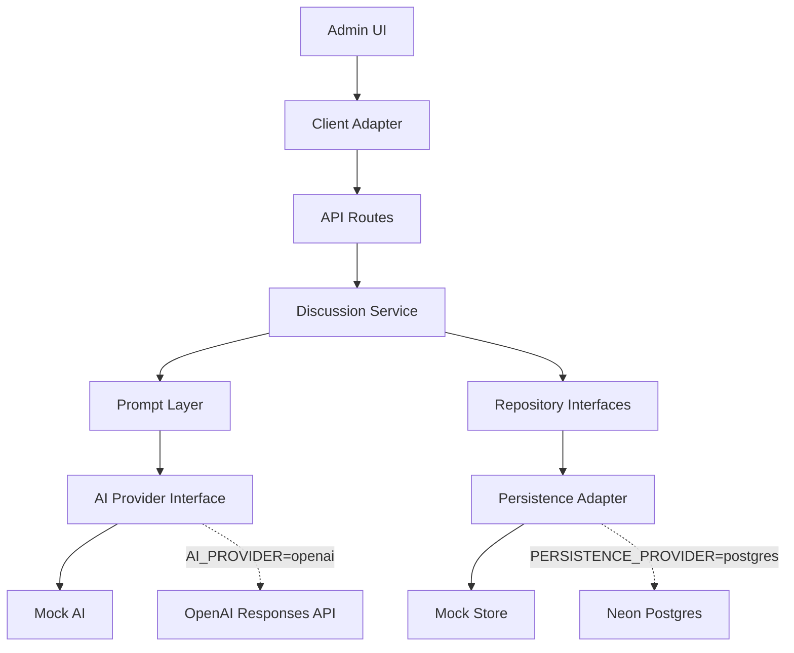
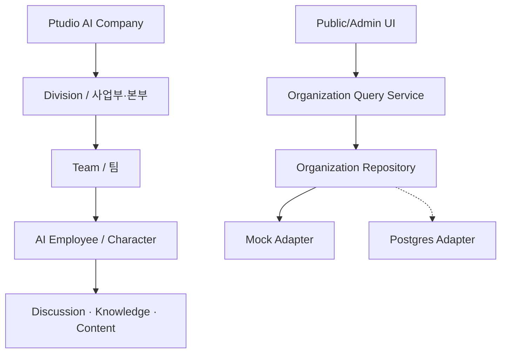

# Ptudio AI Company Intranet BETA Architecture

## 현재 범위

Ptudio AI Company Intranet BETA는 Next.js App Router 기반 Public Web과 Admin CMS, Discussion Engine, Prompt Layer, 교체 가능한 AI/Persistence Provider를 사용합니다. 기본 실행 모드는 `mock`이므로 OpenAI Key와 Database URL 없이 개발·빌드할 수 있습니다.

## 제품 기준과 에셋 소유권

```txt
HQ / Notion (기능·범위 및 Asset Inventory SSOT)
↓
Figma (UI/UX Specification)
↓
Implementation (코드와 배포용 최적화 에셋)
```

- HQ가 Product Specification의 Single Source of Truth입니다.
- Notion Asset Inventory가 승인된 제작 에셋과 사용 상태를 관리합니다.
- Figma는 화면 구성과 UI 표현의 기준입니다.
- 코드는 승인 에셋의 배포용 사본만 보유하며 원본 자산 관리 책임을 중복하지 않습니다.

## 핵심 폴더

- `src/app`: Public/Admin/API Route
- `src/components`: 공용 UI와 Admin Surface
- `src/data`: Mock Seed Data
- `src/types`: Domain/API Type
- `src/lib/discussion-engine`: 토론 생성·검토 Business Logic
- `src/lib/ai`: Prompt, AI Provider, Structured Output Validation
- `src/lib/database`: Kysely/Neon 지연 Database Client
- `src/lib/repositories`: Repository Contract와 Mock/Postgres Adapter
- `src/lib/mock-store`: 임시 In-memory Persistence
- `public/brand`: 승인된 Ptudio 배포용 브랜드 에셋
- `public/assets/ui-v1`: Notion Design Asset 01–09의 배포용 사본

Asset 07–09의 Overview Sheet는 `FeedThumbnail`, `CoreCrystalBadge`, `DivisionIcon` Presentation Component에서만 Crop합니다. 개별 Production Export가 제공되면 해당 컴포넌트의 Asset 경로를 교체하며 Domain, API, Repository에는 영향을 주지 않습니다.

## Discussion Engine Vertical Slice



생성 순서는 `Initial Response → Cross Rebuttal → Consensus → Content Draft → Human Review`입니다. AI 출력은 Structured Output Schema와 Runtime Validator를 통과한 뒤 기존 Domain Model로 변환됩니다. 콘텐츠 초안은 자동 게시하지 않고 `Pending Review` 상태로 저장합니다.

## Organization Query Boundary



`Team`은 정규 Domain 관계이며 Employee는 `teamId`와 `divisionId`를 가집니다. Discussion의 `departmentId`는 기존 API와 Aggregate 호환성을 위한 Legacy 필드로 유지합니다. Public Presentation은 Department를 조직 레벨로 노출하지 않습니다.

## Public Publishing Gate

```txt
Content Draft: Pending Review
→ Approved
→ Published
→ Public Query Boundary
→ Public Discussion List / Detail
```

Public 화면은 정적 Data를 직접 노출하지 않고 `src/lib/public-discussions.ts`를 통해 Repository를 조회합니다. Discussion과 Content Draft가 모두 `Published`일 때만 목록과 상세를 반환하며, Draft·Pending Review·Approved·Archived 상태는 Public에서 조회할 수 없습니다.

Review 상태 변경은 Content Draft와 Discussion을 함께 갱신합니다. Postgres Provider에서는 이 변경과 `published_at`, `public_url` 기록을 하나의 Transaction으로 처리합니다. Admin 생성기는 URL의 `discussionId`로 저장 Flow를 복원하므로 새로고침과 직접 재접속에서도 동일 Aggregate를 사용합니다.

## Provider 규칙

- `AI_PROVIDER` 기본값: `mock`
- `PERSISTENCE_PROVIDER` 기본값: `mock`
- 외부 Client는 요청 시점에 지연 초기화합니다.
- Mock 모드, lint, build 중에는 OpenAI/Database 연결을 만들지 않습니다.
- Service Layer는 실제 Provider 종류를 알지 않으며 Interface에만 의존합니다.
- Provider 교체 시 UI, API Contract, Domain Model, Business Logic을 변경하지 않습니다.

## Persistence Transaction

Postgres Provider의 `saveDiscussionFlow()`는 Discussion, Participant, Source, AI Response, Cross Rebuttal, Consensus, Content Draft를 하나의 Transaction으로 저장하고 실패 시 Rollback합니다. Aggregate 조회 시 동일한 Domain 구조로 재구성합니다.

## Route Layout

- `src/app/(public)/...`: Public Company Portal / Content Page
- `src/app/admin/...`: Admin CMS
- `src/app/api/...`: API Boundary

Route Group은 레이아웃 소유권만 분리하며 외부 URL과 API Contract를 변경하지 않습니다.

## 현재 제외 범위

Authentication, RAG, Tool Calling, Multi-Agent, Long-term Memory, Community, Subscription, Auto News, 자동 게시 기능은 Core MVP 범위 밖입니다.
