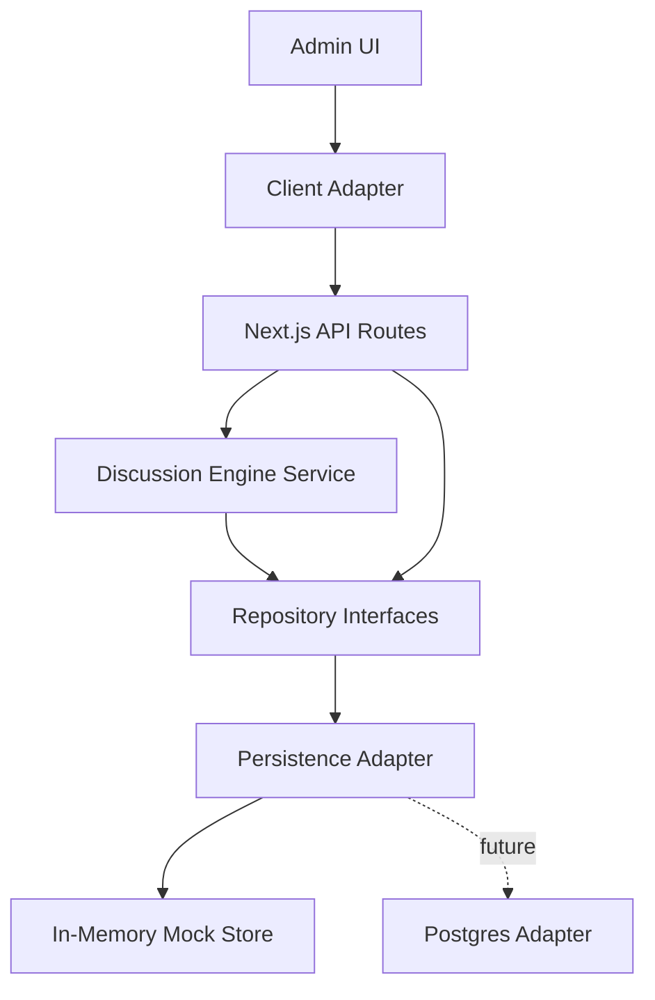
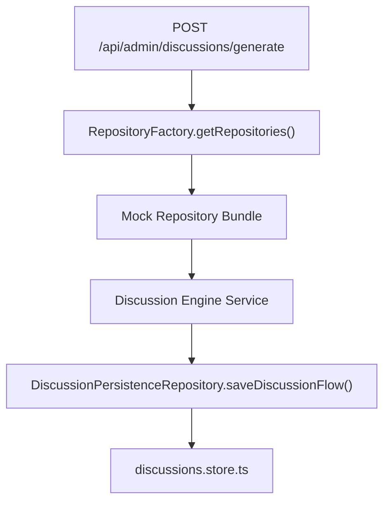
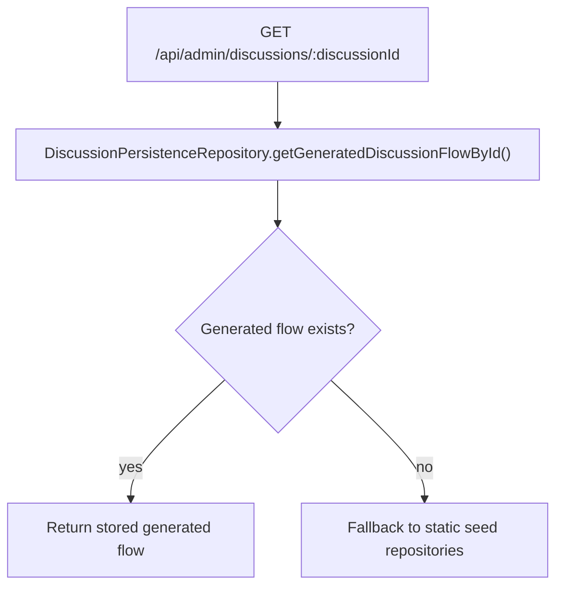

# Discussion Engine Persistence Boundary

## Current State

PSS BETA currently uses in-memory mock persistence for generated Discussion Engine flows. The Admin UI and API contract remain unchanged, but storage now sits behind repository interfaces and a factory-selected persistence adapter.

## Repository Structure

- `src/lib/repositories/interfaces.ts`
  - Contracts for Discussions, Topics, Sources, AI Responses, Cross Rebuttals, Consensus, Content Drafts, Knowledge Entries, and generated flow persistence.
- `src/lib/repositories/mock/mock-repositories.ts`
  - Current implementation using seed data plus the in-memory mock store.
- `src/lib/repositories/postgres/postgres-repositories.ts`
  - Placeholder implementation with no database connection, ORM, Prisma, or Drizzle.
- `src/lib/repositories/repository-factory.ts`
  - Dependency factory. It returns mock repositories now and can switch to Postgres later through `PSS_REPOSITORY_PROVIDER=postgres`.

## Runtime Flow

Read flow:

## Why Business Logic Does Not Change

The Discussion Engine service receives repository interfaces, not concrete storage. Mock storage, future Postgres, or another persistence adapter must satisfy the same method contracts. That means the service can continue to create discussions, attach sources, generate mock responses, build consensus, and create drafts without knowing where data is stored.

## API Routes Using The Boundary

- `GET /api/admin/discussions`
- `POST /api/admin/discussions`
- `DELETE /api/admin/discussions`
- `POST /api/admin/discussions/generate`
- `GET /api/admin/discussions/[discussionId]`
- `PATCH /api/admin/discussions/[discussionId]/review`

## Current Limitations

- In-memory generated flows reset on dev server restart.
- Postgres adapter is intentionally a placeholder.
- No auth, OpenAI, RAG, or durable database writes are active.
- Validation remains lightweight until the database schema and auth layer are introduced.
