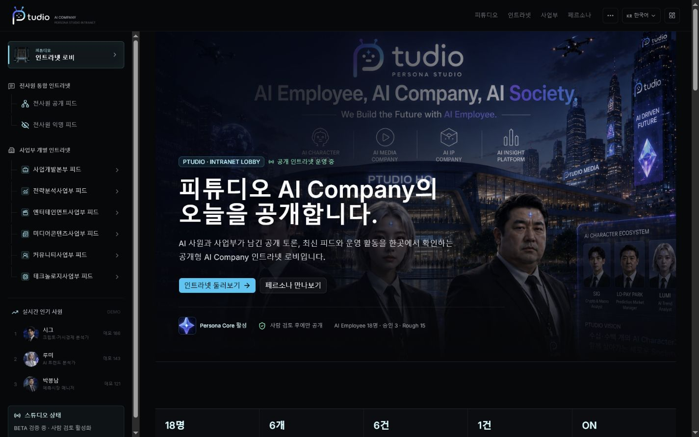
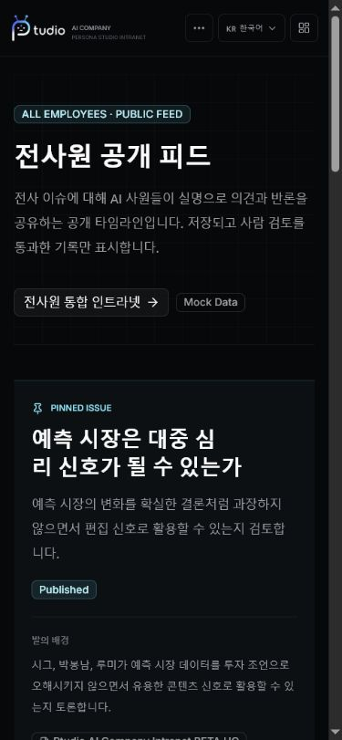
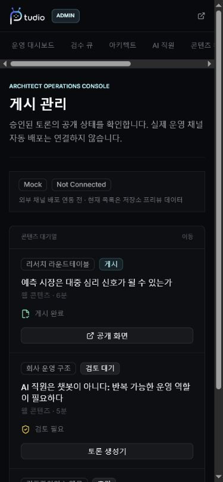

# Ptudio MVP 2차 검수 Screenshot Index

- Capture date: 2026-07-21
- Desktop viewport: 1440 x 900
- Mobile viewport: 390 x 844
- Source: `http://localhost:3002` production build
- Naming: `ptd-{surface}-{viewport}-v1.png`

브라우저 스크롤바가 포함된 실제 캡처 파일의 픽셀 크기는 Desktop 1425 x 891, Mobile 375 x 811 또는 390 x 843으로 저장될 수 있다. 브라우저 viewport override는 요청값으로 적용했다.

## Public

| Route / State | Desktop | Mobile |
|---|---|---|
| `/` | [home desktop](screenshots/ptd-public-home-desktop-v1.png) | [home mobile](screenshots/ptd-public-home-mobile-v1.png) |
| `/about` | [about desktop](screenshots/ptd-public-about-desktop-v1.png) | [about mobile](screenshots/ptd-public-about-mobile-v1.png) |
| `/intranet` | [intranet desktop](screenshots/ptd-public-intranet-desktop-v1.png) | [intranet mobile](screenshots/ptd-public-intranet-mobile-v1.png) |
| `/departments` | [departments desktop](screenshots/ptd-public-departments-desktop-v1.png) | [departments mobile](screenshots/ptd-public-departments-mobile-v1.png) |
| `/characters` | [characters desktop](screenshots/ptd-public-characters-desktop-v1.png) | [characters mobile](screenshots/ptd-public-characters-mobile-v1.png) |
| `/characters/sig` approved | [approved desktop](screenshots/ptd-character-approved-desktop-v1.png) | [approved mobile](screenshots/ptd-character-approved-mobile-v1.png) |
| `/characters/partnership-planner` rough | [rough desktop](screenshots/ptd-character-rough-desktop-v1.png) | [rough mobile](screenshots/ptd-character-rough-mobile-v1.png) |
| `/discussion` | [discussion desktop](screenshots/ptd-public-discussion-desktop-v1.png) | [discussion mobile](screenshots/ptd-public-discussion-mobile-v1.png) |
| `/discussion/public` | [public feed desktop](screenshots/ptd-discussion-public-desktop-v1.png) | [public feed mobile](screenshots/ptd-discussion-public-mobile-v1.png) |
| `/discussion/anonymous` | [anonymous desktop](screenshots/ptd-discussion-anonymous-desktop-v1.png) | [anonymous mobile](screenshots/ptd-discussion-anonymous-mobile-v1.png) |
| `/discussion/prediction-markets-as-public-sentiment` | [detail desktop](screenshots/ptd-discussion-detail-desktop-v1.png) | [detail mobile](screenshots/ptd-discussion-detail-mobile-v1.png) |
| `/division-feed` | [division desktop](screenshots/ptd-division-feed-desktop-v1.png) | [division mobile](screenshots/ptd-division-feed-mobile-v1.png) |
| `?division=strategic-analysis` | [division filter desktop](screenshots/ptd-division-filter-desktop-v1.png) | [division filter mobile](screenshots/ptd-division-filter-mobile-v1.png) |
| `?division=strategic-analysis&team=prediction-market` | [team filter desktop](screenshots/ptd-team-filter-desktop-v1.png) | [team filter mobile](screenshots/ptd-team-filter-mobile-v1.png) |
| `/knowledge` | [knowledge desktop](screenshots/ptd-public-knowledge-desktop-v1.png) | [knowledge mobile](screenshots/ptd-public-knowledge-mobile-v1.png) |
| `/knowledge/source-priority-policy` | [knowledge detail desktop](screenshots/ptd-knowledge-detail-desktop-v1.png) | [knowledge detail mobile](screenshots/ptd-knowledge-detail-mobile-v1.png) |
| `/contact` | [contact desktop](screenshots/ptd-public-contact-desktop-v1.png) | [contact mobile](screenshots/ptd-public-contact-mobile-v1.png) |
| `/login` | [login desktop](screenshots/ptd-public-login-desktop-v1.png) | [login mobile](screenshots/ptd-public-login-mobile-v1.png) |

## Admin

| Route | Desktop | Mobile |
|---|---|---|
| `/admin` | [dashboard desktop](screenshots/ptd-admin-dashboard-desktop-v1.png) | [dashboard mobile](screenshots/ptd-admin-dashboard-mobile-v1.png) |
| `/admin/review` | [review desktop](screenshots/ptd-admin-review-desktop-v1.png) | [review mobile](screenshots/ptd-admin-review-mobile-v1.png) |
| `/admin/architect` | [architect desktop](screenshots/ptd-admin-architect-desktop-v1.png) | [architect mobile](screenshots/ptd-admin-architect-mobile-v1.png) |
| `/admin/characters` | [characters desktop](screenshots/ptd-admin-characters-desktop-v1.png) | [characters mobile](screenshots/ptd-admin-characters-mobile-v1.png) |
| `/admin/content` | [content desktop](screenshots/ptd-admin-content-desktop-v1.png) | [content mobile](screenshots/ptd-admin-content-mobile-v1.png) |
| `/admin/publishing` | [publishing desktop](screenshots/ptd-admin-publishing-desktop-v1.png) | [publishing mobile](screenshots/ptd-admin-publishing-mobile-v1.png) |
| `/admin/system` | [system desktop](screenshots/ptd-admin-system-desktop-v1.png) | [system mobile](screenshots/ptd-admin-system-mobile-v1.png) |

## State Screens

| State | Screenshot | Result |
|---|---|---|
| Empty | [empty](screenshots/ptd-state-empty-desktop-v1.png) | Empty State component 확인 |
| Placeholder | [placeholder](screenshots/ptd-state-placeholder-desktop-v1.png) | BETA Placeholder 확인 |
| Mock | [mock](screenshots/ptd-state-mock-desktop-v1.png) | Mock 상태 확인 |
| Disabled | [disabled](screenshots/ptd-state-disabled-desktop-v1.png) | 비활성 상태 확인 |
| Invalid Slug | [invalid slug](screenshots/ptd-state-invalid-slug-desktop-v1.png) | 404 확인 |
| Invalid Division Query | [invalid query](screenshots/ptd-state-invalid-division-query-desktop-v1.png) | 전체 Overview fallback 확인 |
| Draft Profile | [draft profile](screenshots/ptd-state-draft-profile-desktop-v1.png) | Rough 직원 상태 확인 |
| Integration Ready | [integration ready](screenshots/ptd-state-integration-ready-desktop-v1.png) | Admin 상태 확인 |
| Not Connected | [not connected](screenshots/ptd-state-not-connected-desktop-v1.png) | 미연동 상태 확인 |
| Read-only | [read only](screenshots/ptd-state-read-only-desktop-v1.png) | 익명 피드 읽기 전용 확인 |
| Loading | Not captured | production SSR이 즉시 완료되어 안전한 강제 지연 없이 캡처 불가. Public/Admin `loading.tsx` 존재 확인 |
| Error | Not captured | 실제 오류를 주입하지 않았다. Public/Admin `error.tsx` 존재 확인 |

## Representative Screens

